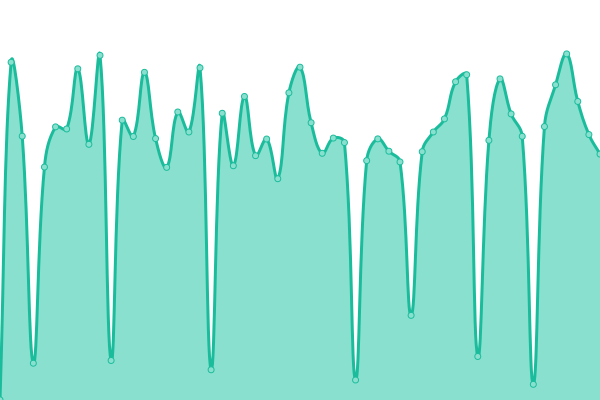
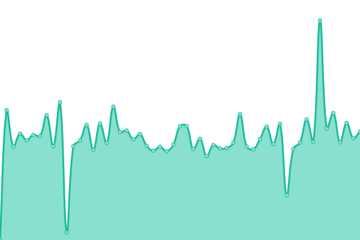
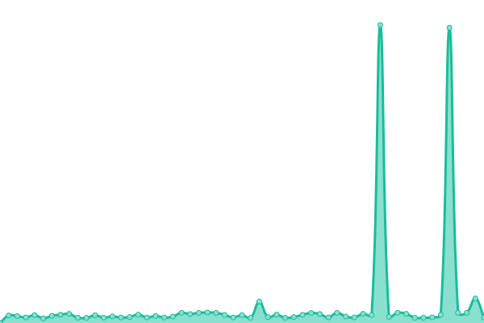
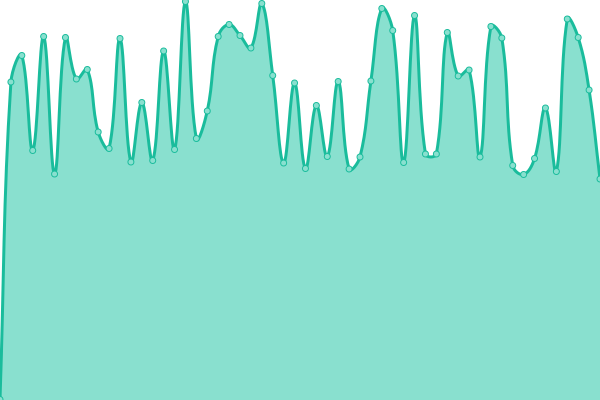

# [📈 Live Status](https://status.divideprojects.com): <!--live status--> **🟩 All systems operational**

This repository contains the open-source uptime monitor and status page for [Divide Projects™](https://divideprojects.com), powered by [Upptime](https://github.com/upptime/upptime).

With [Upptime](https://upptime.js.org), you can get your own unlimited and free uptime monitor and status page, powered entirely by a GitHub repository. We use [Issues](https://github.com/divideprojects/uptime-monitor/issues) as incident reports, [Actions](https://github.com/divideprojects/uptime-monitor/actions) as uptime monitors, and [Pages](https://status.divideprojects.com) for the status page.

<!--start: status pages-->
<!-- This summary is generated by Upptime (https://github.com/upptime/upptime) -->
<!-- Do not edit this manually, your changes will be overwritten -->
<!-- prettier-ignore -->
| URL | Status | History | Response Time | Uptime |
| --- | ------ | ------- | ------------- | ------ |
|  [DivideProjects.com](https://divideprojects.com) | 🟩 Up | [divide-projects-com.yml](https://github.com/divideprojects/uptime-monitor/commits/HEAD/history/divide-projects-com.yml) | 

 149ms
     
 | 

<a href="https://status.divideprojects.com/history/divide-projects-com">100.00%</a>
    

|  [API: hCaptcha Verifier](https://hcaptcha-verifier.divideprojects.com/alive) | 🟩 Up | [api-h-captcha-verifier.yml](https://github.com/divideprojects/uptime-monitor/commits/HEAD/history/api-h-captcha-verifier.yml) | 

 1112ms
     
 | 

<a href="https://status.divideprojects.com/history/api-h-captcha-verifier">100.00%</a>
    

|  [API: ping-back](https://ping-back.divideprojects.com/alive) | 🟩 Up | [api-ping-back.yml](https://github.com/divideprojects/uptime-monitor/commits/HEAD/history/api-ping-back.yml) | 

 1456ms
     
 | 

<a href="https://status.divideprojects.com/history/api-ping-back">100.00%</a>
    

|  Oracle Server | 🟩 Up | [oracle-server.yml](https://github.com/divideprojects/uptime-monitor/commits/HEAD/history/oracle-server.yml) | 

 412ms
     
 | 

<a href="https://status.divideprojects.com/history/oracle-server">100.00%</a>
    

|  [TG Bot: Public Link 🔗 Robot](https://publiclink-bot.divideprojects.com) | 🟩 Up | [tg-bot-public-link-robot.yml](https://github.com/divideprojects/uptime-monitor/commits/HEAD/history/tg-bot-public-link-robot.yml) | 

 752ms
     
 | 

<a href="https://status.divideprojects.com/history/tg-bot-public-link-robot">100.00%</a>
    

|  [TG Bot: Alita_Robot](https://alita-robot.divideprojects.com) | 🟩 Up | [tg-bot-alita-robot.yml](https://github.com/divideprojects/uptime-monitor/commits/HEAD/history/tg-bot-alita-robot.yml) | 

 646ms
     
 | 

<a href="https://status.divideprojects.com/history/tg-bot-alita-robot">100.00%</a>
    

<!--end: status pages-->

[**Visit our status website →**](https://status.divideprojects.com)

## 📄 License

- Powered by: [Upptime](https://github.com/upptime/upptime)
- Code: [MIT](./LICENSE) © [Divide Projects™](https://divideprojects.com)
- Data in the `./history` directory: [Open Database License](https://opendatacommons.org/licenses/odbl/1-0/)
