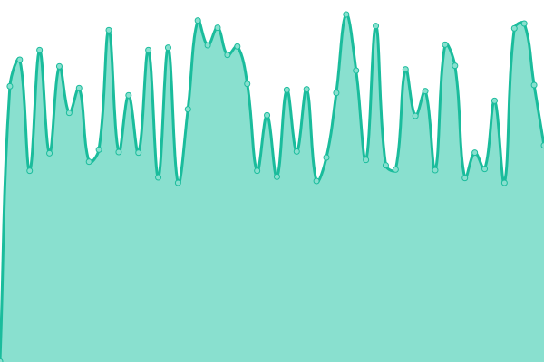

# [📈 Live Status](https://status.divideprojects.com): <!--live status--> **🟩 All systems operational**

This repository contains the open-source uptime monitor and status page for [Divide Projects™](https://divideprojects.com), powered by [Upptime](https://github.com/upptime/upptime).

With [Upptime](https://upptime.js.org), you can get your own unlimited and free uptime monitor and status page, powered entirely by a GitHub repository. We use [Issues](https://github.com/divideprojects/uptime-monitor/issues) as incident reports, [Actions](https://github.com/divideprojects/uptime-monitor/actions) as uptime monitors, and [Pages](https://status.divideprojects.com) for the status page.

<!--start: status pages-->
<!-- This summary is generated by Upptime (https://github.com/upptime/upptime) -->
<!-- Do not edit this manually, your changes will be overwritten -->
<!-- prettier-ignore -->
| URL | Status | History | Response Time | Uptime |
| --- | ------ | ------- | ------------- | ------ |
|  [DivideProjects Website](https://divideprojects.com) | 🟩 Up | [divide-projects-website.yml](https://github.com/divideprojects/uptime-monitor/commits/HEAD/history/divide-projects-website.yml) | 

 107ms
     
 | 

<a href="https://status.divideprojects.com/history/divide-projects-website">100.00%</a>
    

|  [FileStreamBot](https://publiclink-bot.divideprojects.com) | 🟩 Up | [file-stream-bot.yml](https://github.com/divideprojects/uptime-monitor/commits/HEAD/history/file-stream-bot.yml) | 

 369ms
     
 | 

<a href="https://status.divideprojects.com/history/file-stream-bot">100.00%</a>
    

|  [hCaptcha Verifier API](https://hcaptcha-verifier.divideprojects.com/alive) | 🟩 Up | [h-captcha-verifier-api.yml](https://github.com/divideprojects/uptime-monitor/commits/HEAD/history/h-captcha-verifier-api.yml) | 

 1153ms
     
 | 

<a href="https://status.divideprojects.com/history/h-captcha-verifier-api">100.00%</a>
    

|  [ping-back API](https://ping-back.divideprojects.com/alive) | 🟩 Up | [ping-back-api.yml](https://github.com/divideprojects/uptime-monitor/commits/HEAD/history/ping-back-api.yml) | 

 1464ms
     
 | 

<a href="https://status.divideprojects.com/history/ping-back-api">100.00%</a>
    

|  Oracle Server | 🟩 Up | [oracle-server.yml](https://github.com/divideprojects/uptime-monitor/commits/HEAD/history/oracle-server.yml) | 

 439ms
     
 | 

<a href="https://status.divideprojects.com/history/oracle-server">100.00%</a>
    

|  dependabot-auto-merger[bot] | 🟩 Up | [dependabot-auto-merger-bot.yml](https://github.com/divideprojects/uptime-monitor/commits/HEAD/history/dependabot-auto-merger-bot.yml) | 

 143ms
     
 | 

<a href="https://status.divideprojects.com/history/dependabot-auto-merger-bot">100.00%</a>
    

<!--end: status pages-->

[**Visit our status website →**](https://status.divideprojects.com)

## 📄 License

- Powered by: [Upptime](https://github.com/upptime/upptime)
- Code: [MIT](./LICENSE) © [Divide Projects™](https://divideprojects.com)
- Data in the `./history` directory: [Open Database License](https://opendatacommons.org/licenses/odbl/1-0/)
